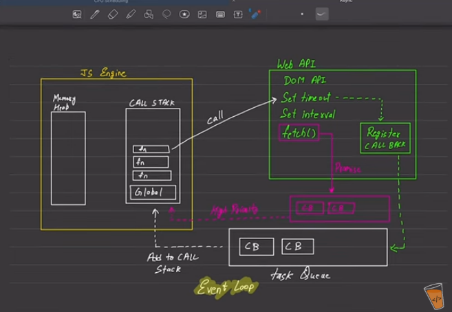

# javascriptindex
A code repo for java script series

## Async javascript

java engine - memory heap and call stack 
call stack - global execution content 
web api - through browser (Node) -- DOM api
task queue - lifo - the stack will be added to engine through stack -
promise queue (high priority queue)'https://api.github.com/users/hiteshchoudhary

call from engine to web api to set timeout or set interval 

in web api register call back 
set time = 1
set time = 0,2 .. it executes in the same time 3 will be executed 
set time = 3

fetch api - expands the task queue to high priority 

## fetch
process of fetching a resource from the network , returning the promise once the response is available.
-Promise error will be recieved as a response 
- we can fetch using {example} not only urls
- fetch executes frst - micro task queue fast queue priority queue

- using fetch works in two parts one in web browser and other on variables memory
- variables - onfilled - resolve 
            - onrejection- rejection

- web brower network request response onfulfilled 404 error

## prototype
array - object - null 
string - object
function - object

